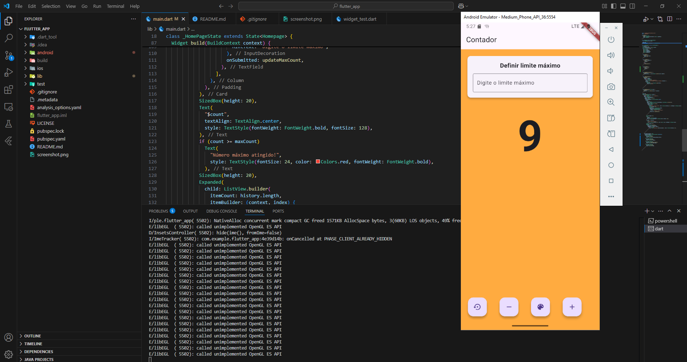

# Jokempo (Pedra, Papel e Tesoura) - Flutter

Este projeto é um jogo simples de Jokempo (Pedra, Papel e Tesoura) desenvolvido em Flutter. Ele permite que o usuário jogue contra a máquina, que faz escolhas aleatórias.

## Desenvolvedores
- **Guilherme Santos** - Matrícula: `123100030`
- **Miguel Estevam** - Matrícula: `12317020`

## 📌 Funcionalidades
- Escolha entre Pedra, Papel ou Tesoura
- Oponente controlado pela maquina
- Exibição do resultado da partida
- Interface simples e responsiva

## 🛠️ Tecnologias Utilizadas
- Flutter
- Dart

## 🚀 Como Executar o Projeto
1. **Clone este repositório**
   ```sh
   git clone https://github.com/MiguelEstevam/jokempoFlutter
   ```
2. **Acesse o diretório do projeto**
   ```sh
   cd jokempo-flutter
   ```
3. **Instale as dependências**
   ```sh
   flutter pub get
   ```
4. **Execute o aplicativo**
   ```sh
   flutter run
   ```

## 📱 Capturas de Tela


## 📄 Licença
Este projeto está sob a licença MIT - veja o arquivo [LICENSE](LICENSE) para mais detalhes.


